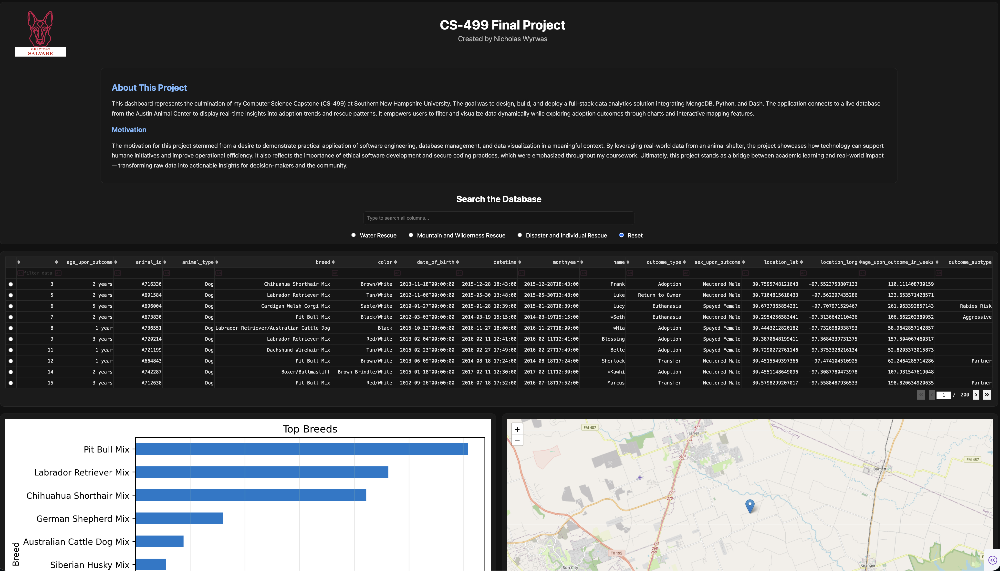

# 🧠 CS-499 Capstone Project: Animal Shelter Data Analytics Dashboard  

**Author:** Nicholas Wyrwas  
**Program:** B.S. Computer Science – Software Engineering  
**Institution:** Southern New Hampshire University  
**Completion Date:** November 2025  

---

## 📘 Project Overview
This capstone project represents the culmination of my Computer Science degree at Southern New Hampshire University. It integrates concepts from software engineering, data management, secure coding, and visualization into one cohesive system.  

The **Animal Shelter Data Analytics Dashboard** is a full-stack Python web application built with **Dash**, **Flask**, **MongoDB**, and **Matplotlib**. It converts my original **CS-340 Client-Server Development** artifact — a Flask CRUD application — into a modern, secure, and visually dynamic analytics dashboard.  

The system allows users to:  
- Interactively view, search, and filter animal adoption data  
- Visualize outcomes by breed, intake type, and location  
- Observe adoption trends through charts and geographic mapping  
- Operate within a secure, validated, and modular architecture  

---

## 🎯 Objectives
- Transform a static CRUD web app into an interactive data-driven dashboard.  
- Implement real-time visualization using Dash and Matplotlib.  
- Apply SEI CERT and OWASP secure-coding standards throughout.  
- Demonstrate software scalability and modular system design.  
- Showcase mastery of SNHU’s Computer Science program outcomes.  

---

## 🧩 Original Artifact – CS-340 Client-Server Development
**Repository:** [CS-340-12210-M01-Client-Server-Development](https://github.com/nwyrwas/CS-340-12210-M01-Client-Server-Development)  

The original artifact was a **Flask + MongoDB** CRUD web application enabling authenticated animal record management.  
**Limitations included:**  
- No real-time visualization or data analytics  
- Limited scalability and user interface design  
- Minimal validation on input fields  
- Lack of modularity and maintainable architecture  

---

## 🚀 Enhanced Artifact – Capstone Dashboard
The enhanced version re-engineers the artifact into a professional-grade data analytics dashboard with the following improvements:  
- **Dash Framework Integration:** Interactive charts, graphs, and UI components.  
- **Matplotlib + Plotly Visualizations:** Dynamic adoption trend analysis.  
- **Leaflet Mapping:** Geospatial visualization of rescue and adoption data.  
- **Secure Database Queries:** Parameterized MongoDB access and sanitization.  
- **Refactored Architecture:** Modular MVC-like structure with reusable functions.  
- **Accessibility:** Dark-mode, responsive layout optimized for both desktop and mobile.  

---

## 🛠️ Technical Stack
| Layer | Technology |
|-------|-------------|
| Front-End | Dash (HTML/CSS/JS rendered in Python) |
| Back-End | Flask + Dash Callbacks |
| Database | MongoDB (CRUD + Aggregation Pipelines) |
| Visualization | Matplotlib · Plotly · Dash Leaflet |
| Environment | Python 3.13 · Virtualenv · VS Code · macOS |
| Version Control | GitHub Repositories & Commits |
| Deployment | GitHub Pages for Docs + Local App Execution |

---

## 💡 Key Features
- **Interactive Charts:** Real-time analytics for adoption rates, animal types, and outcomes.  
- **Search & Filtering:** Query by animal name, breed, outcome, or location.  
- **Map Integration:** Leaflet-based map shows spatial trends in animal rescues.  
- **Security Measures:** Input validation, error handling, and database parameterization.  
- **Scalability:** Modular functions and folder structure support future expansion.  
- **Professional UI:** Clean, accessible dark theme for readability and demonstration.  

---

## 🧠 Skills Demonstrated
- **Software Design & Development:** Refactoring legacy Flask code into modular Dash components.  
- **Algorithms & Data Structures:** Efficient MongoDB querying and aggregation pipelines.  
- **Databases:** Secure CRUD operations with indexing and parameterization.  
- **Security:** Compliance with SEI CERT rules and defense-in-depth principles.  
- **Collaboration & Communication:** Version control, documentation, and video walkthrough.  
- **UI/UX Design:** Human-centered design for clarity and functionality.  

---

## 🎓 Program Outcome Alignment
| Program Outcome | Implementation Evidence |
|-----------------|-------------------------|
| **Software Design and Development** | Rebuilt Flask artifact into modular Dash architecture. |
| **Algorithms and Data Structures** | Optimized MongoDB aggregations and data sorting. |
| **Databases** | Parameterized CRUD operations with data integrity checks. |
| **Security** | Applied CERT standards and input validation controls. |
| **Collaboration and Communication** | GitHub repo, documentation, and code review presentation. |

---

## 🧪 Setup and Execution
```bash
# Clone repository
git clone https://github.com/nwyrwas/CS-499-Capstone-Project.git
cd CS-499-Capstone-Project/Final_Project

# Create and activate virtual environment
python3 -m venv dashenv
source dashenv/bin/activate      # macOS/Linux
dashenv\Scripts\activate         # Windows

# Install dependencies
pip install -r requirements.txt

# Run application
python app.py

```
Once running, open [http://127.0.0.1:8060](http://127.0.0.1:8060) in a browser.

---

## 🖼️ Preview
Below is a snapshot of the final dashboard interface highlighting analytics, search functionality, and visual trends.



---

## 📂 Repository Contents and File Descriptions

| File / Folder | Description |
|----------------|-------------|
| **Final_Project/** | Contains all enhanced application files for the Animal Shelter Dashboard (Dash + Flask code, templates, and data scripts). |
| **Original Artifacts/** | The initial CS-340 Flask CRUD project used as a baseline for enhancement. |
| **Milestone 2.docx** | Narrative describing initial artifact selection and enhancement plan. |
| **Milestone Three Algorithms and Data Structures.docx** | Explains how algorithms and data structures were applied to optimize the system. |
| **Milestone Four.docx** | Final capstone narrative summarizing security improvements and design enhancements. |
| **Professional Self Assessment.docx** | Reflective analysis of growth as a computer scientist and demonstrated competencies. |
| **screenshot.jpg** | Image preview of the final dashboard UI. |
| **README.md** | Documentation of the entire project (you are reading this). |

---

## 🧭 Professional Self-Assessment Summary

My academic journey at **Southern New Hampshire University** equipped me with the knowledge to design, build, and secure complex software systems.  
Through courses such as **CS-305 Software Security**, **CS-350 Emerging Systems Architecture**, **CS-405 Secure Coding**, and **CS-410 Software Reverse Engineering**, I learned to integrate security from the ground up and analyze software behavior at a low level.  

This capstone demonstrates my ability to translate academic concepts into practical solutions that reflect **industry best practices** in **data management**, **visualization**, and **DevSecOps**.  
It highlights my readiness to enter the professional field of software engineering with a solid foundation in full-stack development, system security, and scalable design.

---

## 📺 Code Review Video
A complete code review and walkthrough of the enhanced dashboard will be available on **YouTube** upon final submission.  
**Link:** *(Coming Soon — to be added here)*  

---

## 🔗 Related Links
- 🌐 **GitHub Pages Portfolio:** [https://nwyrwas.github.io](https://nwyrwas.github.io)  
- 💻 **Final Repository:** [CS-499-Capstone-Project](https://github.com/nwyrwas/CS-499-Capstone-Project)  
- 🎓 **Original Artifact Repo:** [CS-340-Client-Server-Development](https://github.com/nwyrwas/CS-340-12210-M01-Client-Server-Development)  
- 🧾 **Professional Self-Assessment:** [Professional Self Assessment.docx](Professional%20Self%20Assessment.docx)
